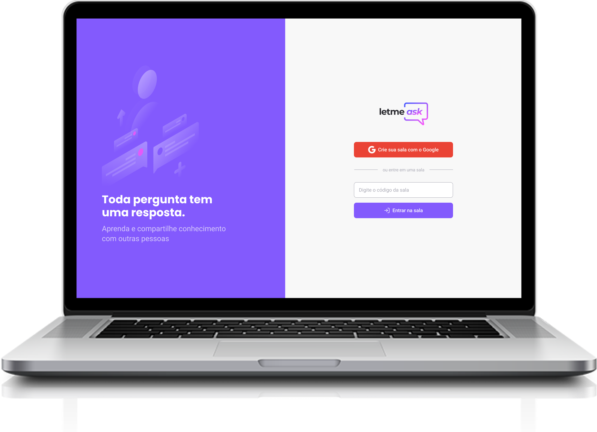

<h1 align="center">
  
</h1>

  

## :computer: Projeto

Letmeask é perfeito para criadores de conteúdos poderem criar salas de Q&A com o seu público, de uma forma muito organizada e democrática.

Este é um projeto desenvolvido durante a Next Level Week Together, apresentada dos dias 20 a 27 de Junho de 2021.

## :bookmark: Layout

O protótipo da versão Web & Mobile se encontra no link abaixo:

* [Protótipo](https://www.figma.com/file/0oOjHq2HUxgBPXN7QiHaMI/Letmeask)

## :zap: Tecnologias

* ReactJS
* TypeScript
* Firebase